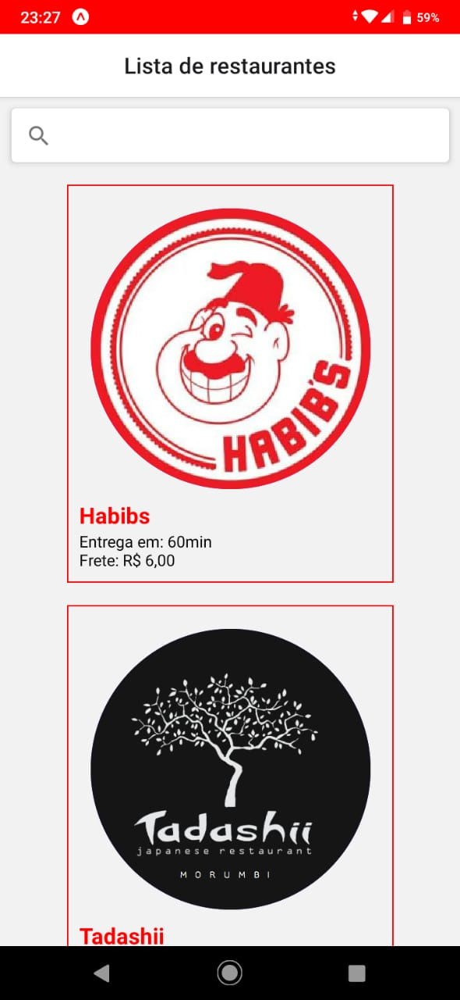
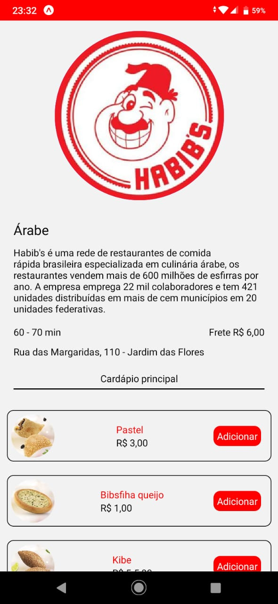
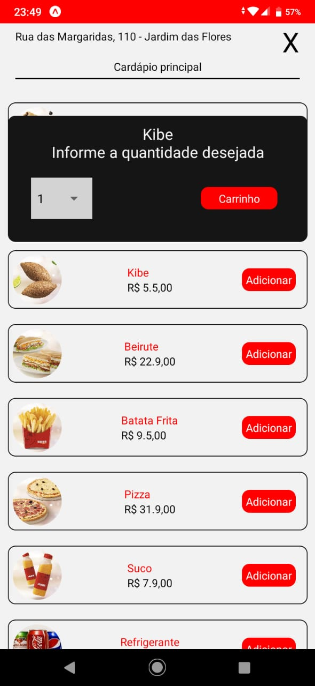
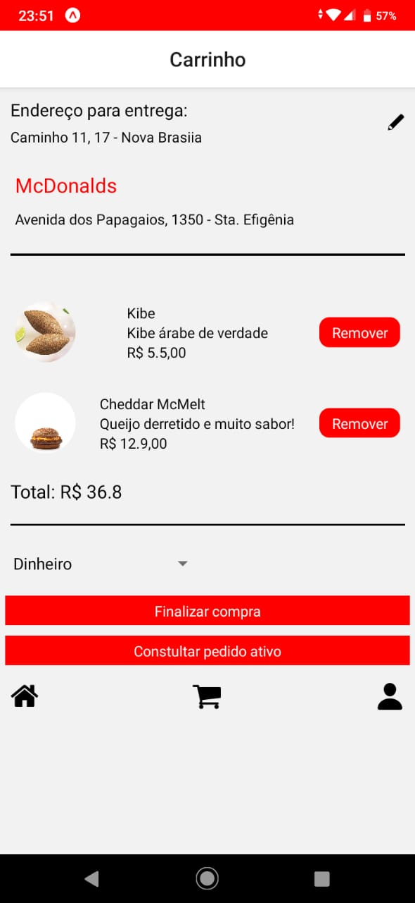

# labefood_mobile

Aplicativo móvel para serviços de restaurantes. O usuário pode se cadastrar no serviço para ter uma conta, que quando logado tem acesso a lista de restaurantes de seus cardápios. 
<li>Lista de restaurantes 
Cliquando em qualquer dos restaurantes você será redirecionado à página dos detalhes do mesmo, onde poderá ver a descrição, endereço, valor do frete e o cardápio oferecido.</li> 
  
<li>Página de detalhes 
Cliquando no botão adicionar um modal para escolher a quantidade do produto referente ao pedido é supenso na tela. Ao clicar no botão carrinho o usuário é direcionado a página do carrinho onde pode ver todos os produtos adicionados e o total referente ao preço e quantidade de cada um. Podendo também, caso queira, remover qualquer dos produtos adicionados ao carro.  

</li> 
<li>Modal  

</li> 
<li>Carrinho  

</li> 

> Obs.: Há também as páginas de login, cadastramento de usuário, cadastramento de endereço e perfil, que não foram colocadas em pauta por serem autodedutivas.
